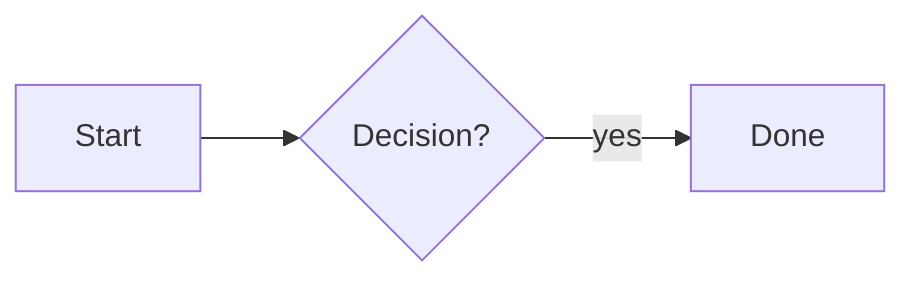

# Hello
```python
code goes here
```
<Callout type="note" title="note">
Write the message here.
</Callout>

as

sa

$x \in \mathbb{R}^n$


$$
x = \frac{-b \pm \sqrt{b^2-4ac}}{2a}
$$


from rdkit import Chem
from rdkit.Chem import Descriptors, Draw

mol = Chem.MolFromSmiles("CC(=O)Oc1ccccc1C(=O)O")
print("SMILES  :", Chem.MolToSmiles(mol))
print("MW      :", round(Descriptors.MolWt(mol), 2))
print("logP    :", round(Descriptors.MolLogP(mol), 2))
print("HBD     :", Descriptors.NumHDonors(mol))

img = Draw.MolToImage(mol, size=(320, 320))
img.save("molecule.png")from rdkit import Chem
from rdkit.Chem import Descriptors, Draw

mol = Chem.MolFromSmiles("CC(=O)Oc1ccccc1C(=O)O")
print("SMILES  :", Chem.MolToSmiles(mol))
print("MW      :", round(Descriptors.MolWt(mol), 2))
print("logP    :", round(Descriptors.MolLogP(mol), 2))
print("HBD     :", Descriptors.NumHDonors(mol))

img = Draw.MolToImage(mol, size=(320, 320))
img.save("molecule.png")


| Column A | Column B |
| --- | --- |
| value 1 | value 2 |
| value 3 | value 4 |
